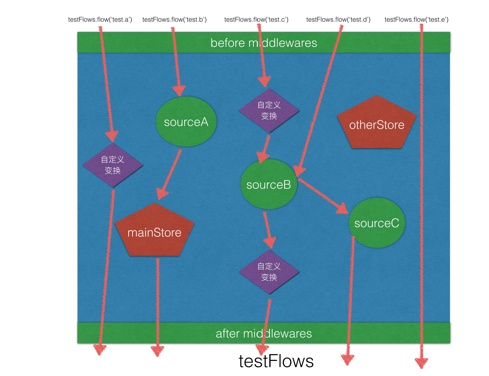

# Gent-Data 优雅的数据管理`工具/思想`

> 基于[RxJS@6](http://reactivex.io/rxjs/manual/overview.html)，函数式响应式编程，集中管理数据流。

> 文档内容中如有不对的地方，欢迎指正。

## 前言1：为什么要`gent-data`

> 现在的vuex，redux，mobx等工具都很优秀很成熟了，为什么还要自己写一个？

主要是为了整理一个很适合自己使用习惯的数据管理工具，当然如果能帮到他人就更好了。所谓工具，自己觉得好用的才是最好的。

> 虽然业界有很多十分强大的状态管理工具，但在实际项目中发现，用起来也存在着一些烦恼：

- 概念相对复杂，使用相对很繁琐，考验团队规范和开发者记忆力
- 分层太多，逻辑分拆后不是很清晰，小项目使用的时候有大炮打蚊子的感觉
- 规范太死，不够灵活，比如特殊情况下，我要获取一个`action`的执行状态，以显示一个`loading`状态，只能通过定义一个额外的state上的数据。
- 还有就是，我们不得不针对不同的项目（vue，react等）使用一套完全不同的状态管理工具。

> 以下是在使用当下流行的状态管理工具时遇到的一些烦恼:

- Mobx：上手难度相对较大，容易踩坑，虽然各种坑在文档上都已经列出来了，但使用的时候还是感觉容易踩。
- Flux or Redux：使用起来比较繁琐，各种action，reducer写起来很考验记忆力，对于接盘的人就更痛苦了。虽然可以通过命名规范来解决，但是有点繁琐
- Vuex：和vue绑定，其他项目没法用。

> 还有，这些各种工具都有一个共同的烦恼：

- 我执行一个action，没办法直接获取这个执行的结果（比如我也显示隐藏loading）。单向数据流没错，但很多情况为了一个action的执行情况去额外定义一个state状态属性。

## 前言2：`gent-data`数据管理思想和原则

> `gent-data`设计的几个目标：

- 化繁为简，使用简单，概念简单。
- 设计灵活，便于扩展和集成。
- 业务逻辑清晰，使用的时候不要记很多东西，便于调试。
- 一套数据，适用于各种场景（React，Vue，纯JS等……），很方便与各种工具集成。

> 在`gent-data`里，我们发现，所有数据管理归纳起来，无外乎都可以划分为以下几部分：

- 【数据存储】：将数据存在一个地方，供之后或者其他消费者取出使用，它们有：自定义store(比如vuex的store), LocalStorage, SessionStorage, Cookie 等。
- 【数据流动、和变换】：一个事件激发一个数据，这个数据沿着一条或者多条路径不断改变、传输，最终到达目的地。比如，`点击按钮`=>`参数`=>`服务器`=>`数据`=>`store改变`=>`通知页面更新`。
- 【变更通知】：数据或者发起的时候通知相关的消费者。

> 那么，我们就针对这两部分来管理就行了:

- `gent-data`(`rxjs`): 解决数据流动变换, `RxJS`有着响应式数据流管理的很强大的功能，`gent-data`是一个扩展工具，帮助我们在rxjs的基础上更好的管理数据流。
- [gent-store](https://github.com/gent-data/gent-store): 解决数据存储。
- 对于变更通知的问题，`gent-store`和`gent-data`都有涉及。

## 安装使用

安装：

```sh
npm i gent-data rxjs -S
```

使用：

```js
import {
  logMiddleware,
  observePromise,
  observeValue,
  sourceToObservable,
  concatMapSource,
  mergeMapSource,
  switchMapSource,
  FlowGroup
} from 'gent-data';
```

store：`gent-store`的情况[gent-store文档](https://github.com/gent-data/gent-store)。

## 开始使用之前，先理解一下两个基本的`RxJS`的概念。

> `Observable`: 可观察对象。

- 描述一个未来的，有一定发射规律的，可调用的，数据或者事件的集合。
- 一个`Observable`可被订阅(subscribe)N次，每次被订阅即产生一个独立的执行(subscription)，然后开始按照规律发射数据。
- 一次执行可以发射多个数据(next)，期间可能发射`next`,`error`,`complete`三个事件。
- 执行可以被取消(unsubscribe)。
- 具体参见[RxJS Observable](http://reactivex.io/rxjs/manual/overview.html#observable) 或者 [RxJs Beta Docs](https://rxjs-dev.firebaseapp.com/guide/overview)。

> `Observer`: 数据观察者。

- 描述数据的接收者。
- 一个观察者是一个有三个回调函数的对象，用来监听数据: `{ next(value){}, error(err){}, complete(){} }`。
- 具体参见[RxJS Observer](http://reactivex.io/rxjs/manual/overview.html#observer) 或者 [RxJs Beta Docs](https://rxjs-dev.firebaseapp.com/guide/overview)。

  - `next`: 接收每一个数据。
  - `error`: 错误时调用。
  - `complete`: 完成时调用。

## 然后，再了解下`gent-data`加入很少的几个概念。

> `Dynamic Source`: 动态数据源，

- 一个动态数据源，是一个可以根据传入条件，动态制造可观察新数据的机器。
- 动态数据源是一个制造数据的方法，每次调用接收两个参数，`resource`：制造数据的资源，`observer`：数据的观察者。
- 动态数据源可以被多次执行。
- 每次执行可发送多个数据。
- 执行可以被取消（可选）。
- 具有`Observable`的特性(发送多个数据，有`next`,`error`,`complete`三个事件，可以取消执行...)，可以很方便地转换为`Observable`。

下面是一个动态数据源的例子：每次执行，根据传入的page，count等参数，发射一个从服务器拉取的用户列表数据。

```js
import request from 'superagent';
import { observePromise } from 'gent-data';

// 获取用户列表
function userList(resource, observer) {
  const params = {page: 1, count: 20, ...resource};
  const req = request.post('/user')
    .send(params);

  // 将promise 和观察者绑定，根据promise的状态自动调用observer的方法
  observePromise(req, observer);

  // 可以返回一个取消执行的方法
  return function cancel() {
    req.abort();
  }
}

// 等价于：
// 获取用户列表
function userList(resource, observer) {
  const params = {page: 1, count: 20, ...resource};
  const req = request.post('/user')
    .send(params);

  req
    .then(v => {
      observer.next(v);
      observer.complete();
    })
    .catch(err => {
      observer.error(err);
      observer.complete();
    });

  // 可以返回一个取消执行的方法
  return function cancel() {
    req.abort();
  }
}
```

下面是将动态数据源转换为`Observable`的例子：

```js
import { userList } from '../source/user';
import { sourceToObservable } from 'gent-data';

// 转换
let observable = sourceToObservable(userList, {page: 1, count: 10});

// 订阅
let subscription = observable.subscribe({
  next(data) {
    //
  },
  error(err) {
    //
  },
  complete() {
    //
  }
});

// 可以取消订阅
subscription.unsubscribe();
// 取消订阅的时候如果这个source还没有完成，会调用上面source返回的cancel方法：
// return function cancel() {
//   req.abort();
// }
```


> `Flow`: 数据流。

> 下面`pipe`的操作请参考[RxJS pipe文档](http://reactivex.io/rxjs/class/es6/Observable.js~Observable.html#instance-method-pipe)。

- 定义一个有一定规律的，数据流动变换的轨迹，比如点击按钮获取用户列表，并加入store，更新界面的一系列数据流动，可以看作一个数据流。
- 每个数据流是一个方法，所做的工作就是将一个`Observable`转换为另外一个`Observable`。
- 接受参数为，变换前的[`Observable`](http://reactivex.io/rxjs/manual/overview.html#observable)。
- 返回结果为，变换后的[`Observable`](http://reactivex.io/rxjs/manual/overview.html#observable)。
- 每个数据流可以进行多次数据变换，也可以流过多个数据源。
- `flow`只是一定数据流动变换的集合，一个操作反馈中的数据变动，可以用一个`flow`，也可以了流经多个`flow`。

```js
import { Observable } from 'rxjs';
import { map, filter, scan, concatMap } from 'rxjs/operators';
import { sourceToObservable } from 'gent-data';
import { userList } from '../source/user';

// 订阅获取用户列表的数据流，just a sample
function getUserListFlow(observable) {
  return observable
    .pipe(
      map((args) => { 
        args.keywords += ' xxx';
        return args;
      })
    )
    .pipe(
      concatMap((v) => {
        return sourceToObservable(userList, v);
      })
    );
}

// 调用flow
let params = { page: 1, count: 20, keywords: 'test' };
let observable = Observable.from([params]);

// 流变换
observable = getUserListFlow(observable);

// 订阅数据流
let subscription = observable.subscribe({
  next(users) {
    console.log(users)
  },
  error(err) {
    //
  },
  complete() {
    //
  }
});
```

> `FlowGroup`：数据流集合。

- `数据流集合`主要用来将一组数据流集中起来，便于管理。
- 一个数据流集合可以为添加在上面的每条数据流`flow`，统一添加前置和后置`中间件`，以便于打印调试和统一变换。
- 可以将`动态数据源`直接添加到上面成为`数据流`。
- 一个项目可以使用多个`FlowGroup`。

推荐：小型项目，一个项目使用一个`FlowGroup`, 大型项目，一个模块一个`FlowGroup`。

```js
import { FlowGroup } from 'gent-data';

const testFlows = new FlowGroup({
  name: 'test', // 便于调试
  beforeMiddlewares: [],
  afterMiddlewares: []
});
```

> `Middleware`: 中间件。

- 一个中间件也是一个数据流`flow`，但是`flow`作为中间件的时候会额外接收一个参数。

下面是一个简单的打印日志的中间件：

```js
function logFlow(observable, middlewareOptions={}) {
  let {
    // 分组名
    groupName,
    // 流的名字
    flowName,
    // 中间件类型：before / after
    middleware
  } = middlewareOptions;

  // 不是作为中间件，而是直接作为flow调用时
  if (!middleware) return observable;

  return observable
    .pipe(
      map((data) => { 
        if (middleware == 'before') {
          console.log(`${groupname}.${flowName} in:`);
        }else if (middleware == 'after') {
          console.log(`${groupname}.${flowName} out:`);
        }

        console.log(JSON.stringify(data))
      })
    );
```

## API

- `Dynamic Source`: 动态数据源，一个函数，接收两个参数， `res`(数据源产生的条件或者资源)，`observer`(数据的观察者)，可以选择性返回一个用于终止数据源的方法。

```js
export function canCancelSource(res, observer) {
  let timer = null;
  let promise = new Promise((resolve, reject) => {
    timer = setTimeout(() => {
      resolve(`${res}-cancel`);
    }, 2000);
  });

  observePromise(promise, observer);

  return function cancel() {
    clearTimeout(timer);
  }
}
```

- `observePromise(promise, observer)`: 将`promise实例`和`观察者`绑定，`resolve`或者`reject`的时候自动调用`observer.next`和`observer.error`, 并且调用`observer.complete`。

```js
import { observePromise } from 'gent-data';

export function promiseSource(res, observer) {
  let promise = Promise.resolve(`${res}-promise`);
  observePromise(promise, observer);
}
```

- `observeValue(value, observer)`: 将`一个值`和`观察者`绑定，自动调用`observer.next`和`observer.complete`。

```js
import { observeValue } from 'gent-data';

export function syncSource(res, observer) {
  observeValue(`${res}-sync`, observer);
}
```

- `sourceToObservable(source, res)`: 将`source`转换为`Observable`，转换的时候里面的数据发射逻辑并不会会执行，只有`observable`被订阅(subscribe)的时候才会执行。

```js
function userListSource(resource, observer) {
  const params = {page: 1, count: 20, ...resource};
  const req = request.post('/user')
    .send(params);

  // 将promise 和观察者绑定，根据promise的状态自动调用observer的方法
  observePromise(req, observer);

  // 可以返回一个取消执行的方法
  return function cancel() {
    req.abort();
  }
}

// 转换的为Observable的时候，请求还未发出
let observable = sourceToObservable(userListSource, { page: 1, count: 10 });

// userListSource执行一次，发出请求
let subscription1 = observable.subscribe({
  //...
});

// userListSource再执行一次，发出另一个请求
let subscription2 = observable.subscribe({
  //...
});

// 终止1发出的请求 req.abort();
subscription.unsubscribe();
```

- `concatMapSource(source)`: 将`source`转换为数据流`flow`。调用这个flow的时候，流入的`observable`每一个数据，会根据`source`生成一个新的`observable`，然后通过[`concatMap`](http://reactivex.io/rxjs/class/es6/Observable.js~Observable.html#instance-method-concatMap)操作符将这些`observable`连接为一个流出的`observable`。

```js
import { of } from 'rxjs';
import { concatMapSource } from 'gent-data';
import { userListSource } from '../source/user';

let observable = of({page: 1, count: 10});
let userListFlow = concatMapSource(userListSource);

let newObservable = userListFlow(observable);
// 还可以应用更多flow：
// newObservable = ooxxFlow(newObservable); 

let subscription = newObservable.subscribe({
  // ...
});
```

- `mergeMapSource(source)`: 和`concatMapSource`一样，只不过通过[`mergeMap`](http://reactivex.io/rxjs/class/es6/Observable.js~Observable.html#instance-method-mergeMap)操作符连接observable。
- `switchMapSource(source)`: 和`concatMapSource`一样，只不过通过[`switchMap`](http://reactivex.io/rxjs/class/es6/Observable.js~Observable.html#instance-method-switchMap)操作符连接observable。

- `logMiddleware`: 日志中间件，打印日志信息。

## FlowGroup

.

- 创建实例

```js
import { FlowGroup, logMiddleware } from 'gent-data';

const myFlows = new FlowGroup({
  name: 'MyFlows',
  beforeMiddlewares: process.env.NODE_ENV === 'production' ? [] : [logMiddleware],
  afterMiddlewares: process.env.NODE_ENV === 'production' ? [] : [logMiddleware]
});

import { testFlow } from '../flows/test';
import * as TestSoureces from '../sources/test';

// 添加flow
myFlows.addFlow(testFlow, 'test');

// 批量添加source
myFlows.addSources(TestSoureces, 'ooxx');

export { myFlows };
```

- 使用

```js
import { of } from 'rxjs';
import { myFlows } from '../flowGroups/myFlows';

let observable = of('hello');
// 应用test flow
observable = myFlows.flow('test')(observable);
// 应用 source.test flow
observable = myFlows.flow('source.test')(observable);

observable.subscribe({
  //
});
```

- `group.addFlow(fn, name="Anonymous")`: 注册flow到group, fn: flow方法。
- `group.addFlows(flowMap={}, context="")`: 批量注册flow，以`key`为`name`，如果`context`不为空，则`name`为`context.key`。
- `group.addSource(source, name="Anonymous", operatorType="concatMap")`：将source转换为flow，再注册到group，`operatorType`为`[concatMap,mergeMap,switchMap]`中的一个，默认`concatMap`。
- `group.addSources(sourceMap, context="", operatorType="concatMap")`: 将一组source转换为flow，再注册到group，默认`concatMap`。
- `group.setBeforeMiddlewares(middlewares=[])`: 设置前置中间件。
- `group.setAfterMiddlewares(middlewares=[])`: 设置后置中间件。
- `group.flow(name)`: 获取中间件。

## 推荐目录结构

```
---- data
  |---- sources
  |---- flows
  |---- flowGroups
  |---- stores
```

## 辅助工具

- 数据存储：`gent-store`，目前只能订阅数据总变更，后期考虑添加数据响应是，可按属性订阅变更。

```js
import mainStore from '../stores/main';

export function storeSource(res, observer) {
  return mainStore.subscribe(observer);
}
```

- 和vue集成：[gent-vue](https://github.com/gent-data/gent-vue)，比较粗糙，提供一个可以用的工具和实现思想，不代表最佳实践。
- 和react集成：[gent-react](https://github.com/gent-data/gent-react)，比较粗糙，提供一个可以用的工具和实现思想，不代表最佳实践。

## 完整实例

- [gent-demo](https://github.com/gent-data/gent-demo)。